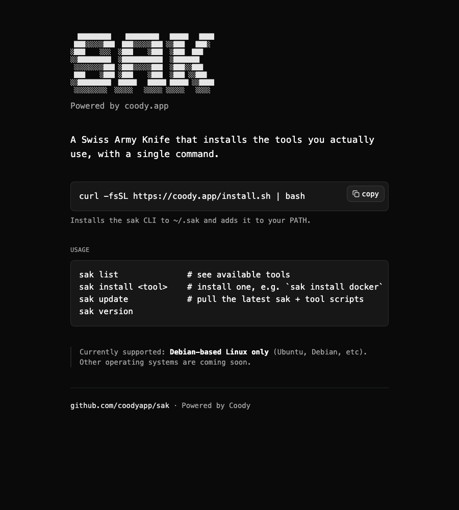

# SAK

[](https://github.com/coodyapp/sak/actions/workflows/ci-cli.yaml)
[](https://github.com/coodyapp/sak/actions/workflows/ci-worker.yaml)
[](https://github.com/coodyapp/sak/actions/workflows/ci-www.yaml)
[](LICENSE)
[](https://github.com/coodyapp/sak/releases)



A Swiss Army Knife that installs the tools you actually use, with a single
command:

```bash
curl -fsSL https://coody.app/install.sh | bash
```

This installs the `SAK` CLI to `~/.sak` and adds it to your `PATH`. You can
also install a tool directly in one shot:

```bash
curl -fsSL https://coody.app/install.sh | bash -s -- install docker
```

Currently supported: **Debian-based Linux and macOS** for `sak` itself and
the ops commands. **Installing tools** (`sak install <tool>`) requires
**Debian-based Linux** (Ubuntu, Debian, etc) — tool installers haven't been
ported to macOS package managers yet.

## Usage

```bash
sak list              # see available tools
sak install <tool>    # install one, e.g. `sak install docker`
sak update             # pull the latest sak + tool scripts
sak version
```

### Ops commands

One-shot maintenance tasks against a provider's API/CLI — credentials come
from environment variables, never hardcoded:

```bash
sak cloudflare dns [tunnel-id]      # delete DNS CNAMEs pointing at a tunnel
sak cloudflare ip [tunnel-id]       # delete private network IP routes for a tunnel
sak cloudflare tunnels              # list tunnels for the authenticated account
sak cloudflare mtls <domain>        # issue an mTLS cert via acme.sh + Cloudflare DNS challenge
sak cloudflare worker-purge         # bulk-delete non-production Cloudflare Pages deployments
sak gh prs [gh pr list args...]     # list PRs for the current repo
sak gh purge-artifacts <user> [org] # bulk-delete GitHub Actions artifacts
```

Run `sak cloudflare` or `sak gh` with no action to see the list of available
actions and which environment variables each one needs.

## Adding a tool

Drop a self-contained, idempotent script at `apps/cli/src/<tool>/setup.sh`.
It will show up automatically in `sak list` and run via `sak install <tool>`.
See `apps/cli/src/docker/setup.sh` for the existing example.

## Local development

Run SAK straight from a checkout, without installing it:

```bash
./apps/cli/run.sh list
./apps/cli/run.sh install docker
```

## Repo layout

This is an [Nx](https://nx.dev) monorepo, mainly for `nx affected`-driven CI
across the few pieces below — there's no compiled code here, so Nx isn't
buying caching or codegen, just consistent lint/test/deploy targets.

- `apps/cli/` — the SAK CLI itself (`bin/`, `lib/`, `src/`, `ops/`, `run.sh`).
  `src/` holds tool installers (`sak install <tool>`); `ops/` holds one-shot
  provider maintenance commands (`sak <namespace> <action>`).
- `install.sh` stays at the repo root — it's fetched by a hardcoded URL from
  the Worker that serves `coody.app/install.sh`, and it extracts
  `apps/cli/` from the downloaded tarball into `$SAK_HOME`.
- `apps/worker/` — the Cloudflare Worker serving `coody.app/install.sh`.
- `apps/www/` — the Vite + React + Tailwind + shadcn/ui site at
  `sak.coody.app`.
- `test/cli/` — bats tests for `apps/cli/bin/sak`.

`apps/worker/` and `apps/www/` use [pnpm](https://pnpm.io) workspaces
(`pnpm install` from the repo root). `apps/cli/` has no `package.json` — it's
plain bash, linted with shellcheck and tested with bats, no install step
needed.

## Infrastructure

`coody.app/install.sh` is served by a Cloudflare Worker (`coody-sak-prd-01`)
that proxies this repo's `install.sh` — see
[`apps/worker/README.md`](apps/worker/README.md) for the deploy runbook.
`sak.coody.app` is a static site served by a separate Worker
(`coody-sak-www-prd-01`) — see [`apps/www/README.md`](apps/www/README.md).

## Contributing

Bug reports and PRs are welcome — see [`CONTRIBUTING.md`](CONTRIBUTING.md)
for dev setup and how to add a tool. Please also read the
[Code of Conduct](CODE_OF_CONDUCT.md). SAK is [MIT licensed](LICENSE).
